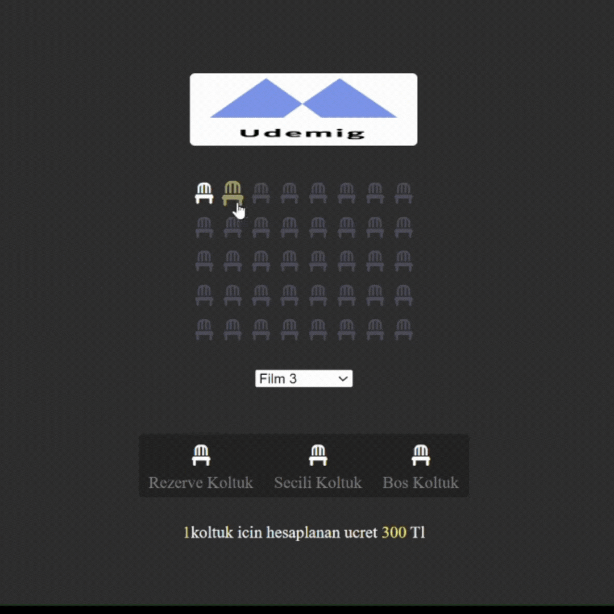

# 🎥 Sinema Rezervasyonu 🍿

Bu projede **Ebru** sanatını tanıtmak için hazırladığım web sitesinin kaynak kodları bulunmaktadır.

Bu JavaScript kodu, bir sinema koltuk rezervasyon sistemini simüle etmek için tasarlanmıştır
## 📽️ Screenshots 📽️

##YAPILANLAR:

HTML Elemanlarını Seçme:

container: Tüm koltukların içinde bulunduğu kapsayıcı div seçilir.
infoText, movieList, seatCount, totalAmount: Bu elemanlar, bilgi metni, film listesi, seçili koltuk sayısı ve toplam tutarı göstermek için kullanılan HTML elemanlarıdır.
seats: Rezervli (rezerve) olmayan tüm koltuklar seçilir.
Veri Kaydetme Fonksiyonu (saveToDatabase):

Bir index parametresi alır ve bunu seatsIndex anahtarıyla localStorage'a JSON formatında kaydeder.
Ayrıca, seçili filmin indeksini movieIndex anahtarına kaydeder.
Veri Alma Fonksiyonu (getFromDatabase):

localStorage'dan daha önce kaydedilen seatsIndex ve movieIndex verilerini çeker.
Eğer seatsIndex verisi varsa, bu indekslere karşılık gelen koltuklar seçilmiş (selected) olarak işaretlenir.
movieIndex'e göre movieList'in seçili indeksi ayarlanır.
İndeks Oluşturma Fonksiyonu (createIndex):

Tüm koltuklar bir diziye (allSeatsArray) eklenir.
Seçili koltuklar (selected) ayrı bir diziye (allSelectedSeatsArray) eklenir.
Seçili koltukların indeksleri bulunur ve bu indeksler saveToDatabase fonksiyonuna kaydedilir.
Toplamı Hesaplama Fonksiyonu (calculateTotal):

Önce createIndex fonksiyonu çağrılır.
Seçili koltuk sayısı hesaplanır ve seatCount HTML elemanına yazılır.
Toplam tutar hesaplanır ve totalAmount HTML elemanına yazılır.
Eğer seçili koltuk varsa, infoText elemanı görünür hale getirilir, yoksa gizlenir.
Etkinlik Dinleyicileri:

container için bir tık (click) etkinlik dinleyicisi eklenir: Bir koltuk tıklandığında, eğer koltuk rezervli değilse, bu koltuk seçilmiş olarak işaretlenir ya da seçim kaldırılır.
movieList için bir değişim (change) etkinlik dinleyicisi eklenir: Film seçimi değiştiğinde toplam hesaplamalar tekrar yapılır.
Bu sistemi kullanarak kullanıcı, koltukları seçebilir, film fiyatına göre ödenecek toplam tutarı görebilir ve bu veriler tarayıcı kapandığında bile localStorage kullanılarak saklanır. Bu, bir sinema rezervasyon sistemi veya koltuk rezervasyonu uygulaması için temel bir yapıyı temsil eder.# 26-Sinema-Rezervasyon
